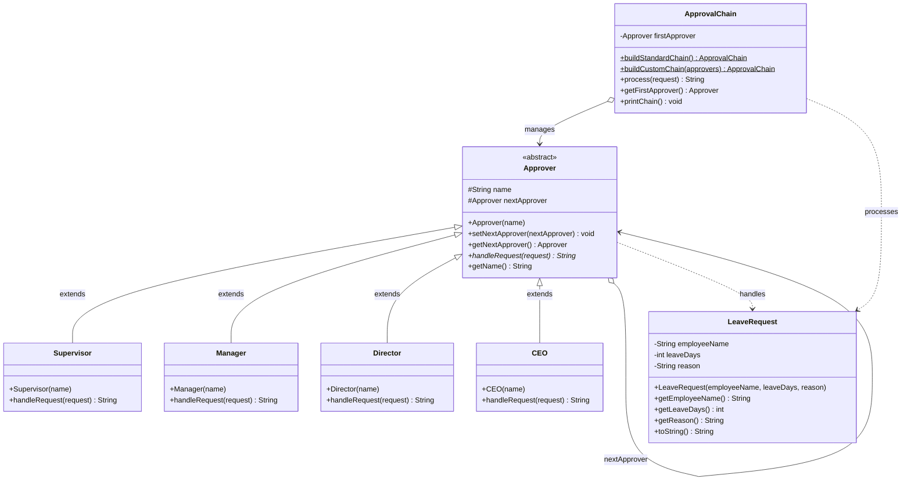
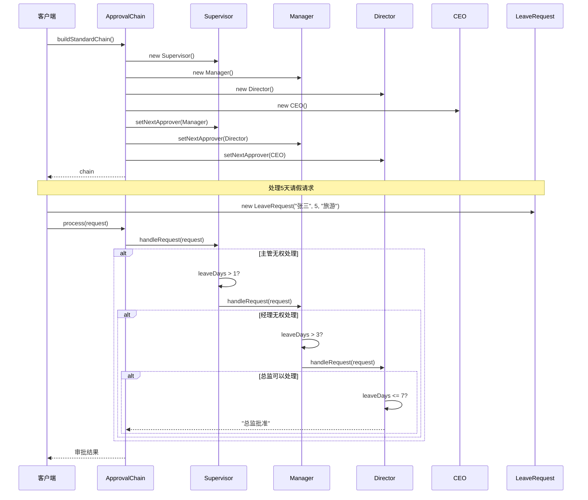

# 责任链模式 (Chain of Responsibility Pattern)

## 模式简介

责任链模式是一种行为型设计模式，它允许你将请求沿着处理者链传递，直到某个处理者处理它为止。该模式让多个对象都有机会处理请求，从而避免了请求的发送者和接收者之间的耦合关系。

## UML 类图结构

### Mermaid 类图



### ASCII 类图（简化版）

```
┌─────────────────────────────────────┐
│   <<abstract>>                      │
│      Approver                       │
├─────────────────────────────────────┤
│ # name: String                      │
│ # nextApprover: Approver            │
├─────────────────────────────────────┤
│ + setNextApprover(Approver): void   │
│ + handleRequest(Request): String    │
└─────────────────────────────────────┘
           △
           │ extends
    ┌──────┼──────┬──────────┬──────┐
    │      │      │          │      │
┌───┴──┐ ┌─┴───┐ ┌─┴──────┐ ┌─┴──┐
│Super │ │Mgr  │ │Director│ │CEO │
│visor │ │     │ │        │ │    │
├──────┤ ├─────┤ ├────────┤ ├────┤
│≤1天  │ │≤3天 │ │≤7天    │ │任意│
└──────┘ └─────┘ └────────┘ └────┘
                    │
                    │ handles
                    ▼
          ┌──────────────────┐
          │  LeaveRequest    │
          ├──────────────────┤
          │ - employeeName   │
          │ - leaveDays      │
          │ - reason         │
          └──────────────────┘
```

## 协作流程

### Mermaid 序列图



### ASCII 序列图（简化版）

```
客户端      ApprovalChain    Supervisor    Manager    Director
  │              │               │            │           │
  │ process(5天) │               │            │           │
  │─────────────>│               │            │           │
  │              │ handleRequest │            │           │
  │              │──────────────>│            │           │
  │              │               │ 无权处理    │           │
  │              │               │───────────>│           │
  │              │               │            │ 无权处理   │
  │              │               │            │──────────>│
  │              │               │            │           │
  │              │               │            │  批准(≤7天)│
  │              │               │            │<──────────│
  │              │               │  结果       │           │
  │              │               │<───────────│           │
  │              │  结果          │            │           │
  │              │<──────────────│            │           │
  │  审批结果     │               │            │           │
  │<─────────────│               │            │           │
```

## 角色说明

### 1. Handler（抽象处理者）
- **Approver**：抽象审批者类
- **职责**：定义处理请求的接口，维护对下一个处理者的引用
- **方法**：
  - `handleRequest()`: 处理请求（抽象方法）
  - `setNextApprover()`: 设置下一个处理者
  - `getNextApprover()`: 获取下一个处理者

### 2. ConcreteHandler（具体处理者）
- **Supervisor**：主管，可审批 ≤1 天
- **Manager**：经理，可审批 ≤3 天
- **Director**：总监，可审批 ≤7 天
- **CEO**：总经理，可审批任意天数（≤30天）
- **职责**：实现具体的处理逻辑，决定是否处理请求或传递给下一个处理者

### 3. Request（请求类）
- **LeaveRequest**：请假请求
- **职责**：封装请求信息（员工姓名、请假天数、请假原因）

### 4. Chain Builder（责任链构建器）
- **ApprovalChain**：责任链构建和管理类
- **职责**：构建责任链、处理请求、打印链结构

## 模式优点

1. **降低耦合度** - 请求发送者和接收者解耦，发送者不需要知道哪个对象会处理请求
2. **简化对象** - 对象不需要知道链的结构，只需要保留对下一个对象的引用
3. **增强灵活性** - 可以动态地增加或删除处理者，改变处理者的顺序
4. **增强职责分配** - 每个处理者专注于自己的职责，符合单一职责原则
5. **符合开闭原则** - 增加新的处理者不需要修改现有代码

## 模式缺点

1. **请求可能未被处理** - 如果链配置不当，请求可能到达链尾仍未被处理
2. **性能问题** - 请求可能需要遍历整个链才能被处理
3. **调试困难** - 运行时特征不明显，调试时不方便观察

## 使用场景

1. **有多个对象可以处理同一个请求** - 具体哪个对象处理由运行时决定
2. **在不明确指定接收者的情况下，向多个对象中的一个提交请求**
3. **可动态指定一组对象处理请求** - 需要灵活地改变处理顺序
4. **需要按照一定顺序执行多个处理者** - 例如：审批流程、日志处理

## 代码示例

```java
// 构建标准审批责任链
ApprovalChain chain = ApprovalChain.buildStandardChain();

// 打印责任链结构
chain.printChain();

// 处理请假请求
LeaveRequest request = new LeaveRequest("张三", 5, "家庭原因");
String result = chain.process(request);

// 自定义责任链
Approver manager = new Manager("李经理");
Approver ceo = new CEO("王CEO");
ApprovalChain customChain = ApprovalChain.buildCustomChain(manager, ceo);
```

## 运行测试

```bash
# 运行所有测试
mvn test -Dtest=ChainPatternTest

# 运行演示程序
mvn exec:java -Dexec.mainClass="com.richal.learn.chain.ChainPatternTest"
```

## 实现特点

1. **标准链构建** - 提供标准的四级审批链（主管->经理->总监->CEO）
2. **自定义链构建** - 支持自定义审批者和顺序
3. **链结构打印** - 可视化展示责任链结构
4. **完整测试** - 12 个测试用例覆盖各种场景

## 审批权限表

| 审批者 | 权限范围 | 处理逻辑 |
|--------|---------|---------|
| 主管 (Supervisor) | ≤ 1天 | 超出权限转交经理 |
| 经理 (Manager) | ≤ 3天 | 超出权限转交总监 |
| 总监 (Director) | ≤ 7天 | 超出权限转交CEO |
| CEO | ≤ 30天 | 超过30天拒绝 |

## 与其他模式的关系

1. **责任链模式 vs 装饰器模式**
   - 责任链：请求可能被链中任意一个处理者处理
   - 装饰器：所有装饰器都会处理请求

2. **责任链模式 vs 组合模式**
   - 责任链：线性结构，单向传递
   - 组合：树形结构，可以向上或向下传递

## 实际应用

### Java 标准库中的责任链模式

1. **Servlet Filter 链**
```java
public class MyFilter implements Filter {
    public void doFilter(ServletRequest request,
                        ServletResponse response,
                        FilterChain chain) {
        // 前置处理
        chain.doFilter(request, response);  // 传递给下一个过滤器
        // 后置处理
    }
}
```

2. **异常处理链**
```java
try {
    // 代码
} catch (IOException e) {
    // 处理 IOException
} catch (Exception e) {
    // 处理其他异常
}
```

### Spring 框架中的责任链模式

- **Spring Security 过滤器链** - 多个安全过滤器组成责任链
- **Spring MVC 拦截器链** - HandlerInterceptor 形成责任链

## 扩展思考

1. 如何实现双向责任链（可以向前或向后传递）？
2. 如何实现带有优先级的责任链？
3. 如何在责任链中添加日志记录功能？
4. 如何实现可以中断的责任链？
5. 如何结合策略模式来选择不同的处理策略？

## 作者

Richal - HandMade 手搓学习笔记项目
