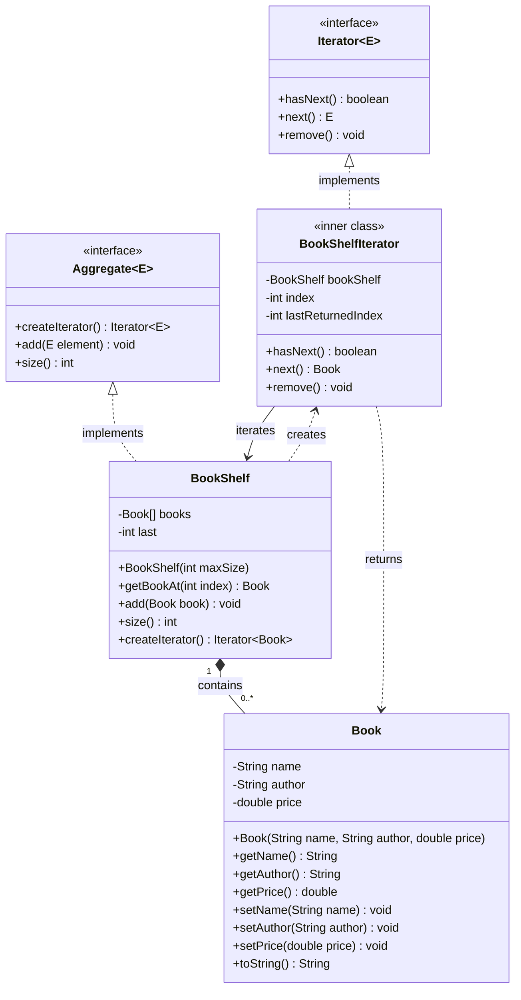
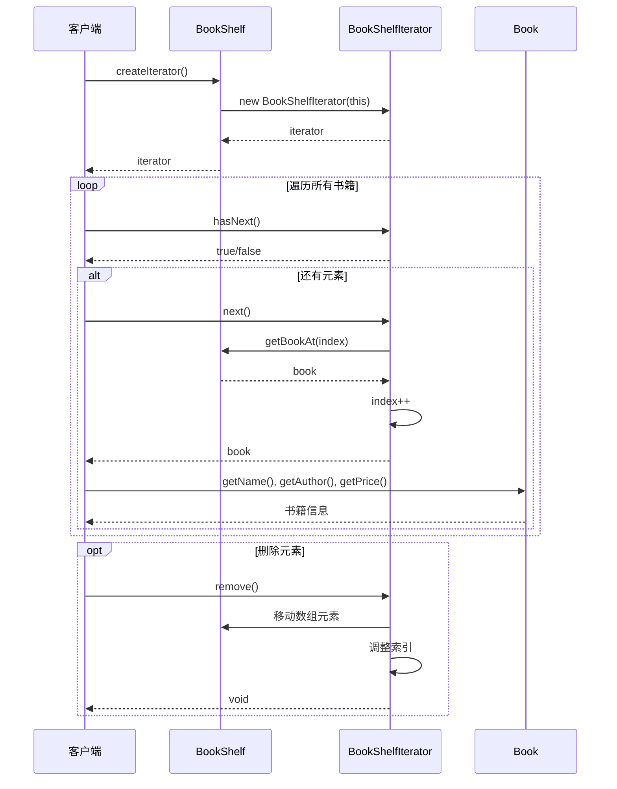

# 迭代器模式 - 类图说明

## UML 类图结构

### Mermaid 类图



### ASCII 类图（简化版）

```
┌─────────────────────────────────┐
│   <<interface>>                 │
│      Iterator<E>                │
├─────────────────────────────────┤
│ + hasNext(): boolean            │
│ + next(): E                     │
│ + remove(): void                │
└─────────────────────────────────┘
           △
           │ implements
           │
┌──────────┴──────────────────────────────┐
│    BookShelfIterator                    │
│    <<inner class>>                      │
├─────────────────────────────────────────┤
│ - bookShelf: BookShelf                  │
│ - index: int                            │
│ - lastReturnedIndex: int                │
├─────────────────────────────────────────┤
│ + hasNext(): boolean                    │
│ + next(): Book                          │
│ + remove(): void                        │
└─────────────────────────────────────────┘


┌─────────────────────────────────┐
│   <<interface>>                 │
│     Aggregate<E>                │
├─────────────────────────────────┤
│ + createIterator(): Iterator<E> │
│ + add(E element): void          │
│ + size(): int                   │
└─────────────────────────────────┘
           △
           │ implements
           │
┌──────────┴──────────────────────────────┐
│         BookShelf                       │
├─────────────────────────────────────────┤
│ - books: Book[]                         │
│ - last: int                             │
├─────────────────────────────────────────┤
│ + BookShelf(maxSize: int)               │
│ + getBookAt(index: int): Book           │
│ + add(book: Book): void                 │
│ + size(): int                           │
│ + createIterator(): Iterator<Book>      │
└─────────────────────────────────────────┘
           │
           │ contains
           ▼
┌─────────────────────────────────┐
│         Book                    │
├─────────────────────────────────┤
│ - name: String                  │
│ - author: String                │
│ - price: double                 │
├─────────────────────────────────┤
│ + Book(...)                     │
│ + getName(): String             │
│ + getAuthor(): String           │
│ + getPrice(): double            │
│ + toString(): String            │
└─────────────────────────────────┘
```

## 角色说明

### 1. Iterator（迭代器接口）
- **职责**：定义遍历元素的接口
- **方法**：
  - `hasNext()`: 判断是否还有下一个元素
  - `next()`: 返回下一个元素
  - `remove()`: 删除当前元素

### 2. BookShelfIterator（具体迭代器）
- **职责**：实现 Iterator 接口，负责遍历 BookShelf
- **特点**：
  - 作为 BookShelf 的内部类，可以访问 BookShelf 的私有成员
  - 维护当前遍历位置（index）
  - 支持删除操作

### 3. Aggregate（聚合接口）
- **职责**：定义创建迭代器的接口
- **方法**：
  - `createIterator()`: 创建并返回一个迭代器
  - `add()`: 添加元素
  - `size()`: 返回元素数量

### 4. BookShelf（具体聚合类）
- **职责**：实现 Aggregate 接口，管理 Book 对象集合
- **特点**：
  - 使用数组存储元素
  - 支持自动扩容
  - 创建并返回 BookShelfIterator 实例

### 5. Book（元素类）
- **职责**：表示集合中的具体元素
- **属性**：书名、作者、价格

## 协作流程

### Mermaid 序列图



### ASCII 序列图（简化版）

```
客户端                BookShelf           BookShelfIterator
  │                      │                       │
  │  createIterator()    │                       │
  │─────────────────────>│                       │
  │                      │   new Iterator        │
  │                      │──────────────────────>│
  │                      │                       │
  │<─────────────────────┼───────────────────────│
  │                      │                       │
  │  hasNext()           │                       │
  │──────────────────────┼──────────────────────>│
  │<─────────────────────┼───────────────────────│
  │                      │                       │
  │  next()              │                       │
  │──────────────────────┼──────────────────────>│
  │                      │   getBookAt(index)    │
  │                      │<──────────────────────│
  │                      │   return book         │
  │                      │──────────────────────>│
  │<─────────────────────┼───────────────────────│
  │                      │                       │
```

## 设计要点

1. **封装性**：BookShelf 的内部结构（数组）对客户端不可见
2. **单一职责**：遍历逻辑由 Iterator 负责，BookShelf 只负责存储
3. **灵活性**：可以为 BookShelf 实现多种不同的迭代器（如反向迭代器）
4. **一致性**：所有聚合类都通过统一的 Iterator 接口进行遍历

## 实际应用

在 Java 集合框架中：
- `java.util.Iterator` 对应 Iterator 接口
- `java.util.Collection` 对应 Aggregate 接口
- `ArrayList.Itr` 对应 BookShelfIterator（内部类实现）
- `ArrayList` 对应 BookShelf
