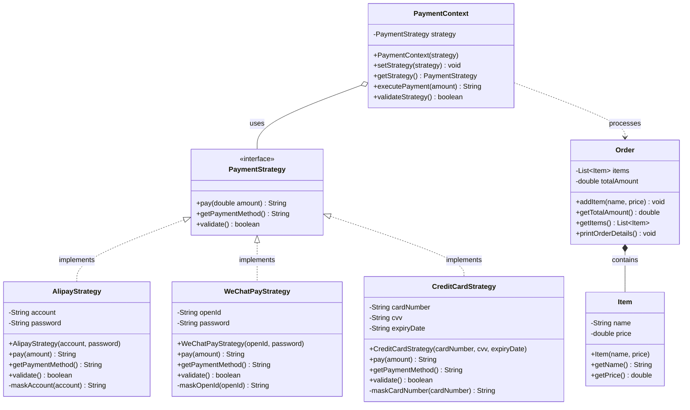
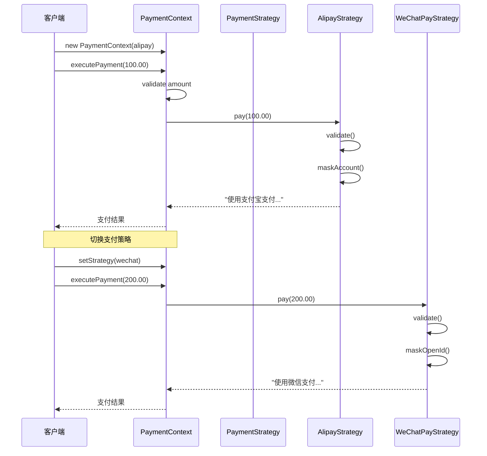

# 策略模式 (Strategy Pattern)

## 模式简介

策略模式是一种行为型设计模式，它定义了一系列算法，把它们封装起来，并且使它们可以互换。策略模式让算法独立于使用它的客户端而变化。

## UML 类图结构

### Mermaid 类图



### ASCII 类图（简化版）

```
┌─────────────────────────────────────┐
│   <<interface>>                     │
│      PaymentStrategy                │
├─────────────────────────────────────┤
│ + pay(amount): String               │
│ + getPaymentMethod(): String        │
│ + validate(): boolean               │
└─────────────────────────────────────┘
           △
           │ implements
    ┌──────┼──────┬──────────────┐
    │      │      │              │
┌───┴──────┴──┐ ┌─┴──────────┐ ┌─┴──────────────┐
│ AlipayStrategy│ │WeChatPay   │ │CreditCard      │
│               │ │Strategy    │ │Strategy        │
├───────────────┤ ├────────────┤ ├────────────────┤
│-account       │ │-openId     │ │-cardNumber     │
│-password      │ │-password   │ │-cvv            │
│               │ │            │ │-expiryDate     │
├───────────────┤ ├────────────┤ ├────────────────┤
│+pay()         │ │+pay()      │ │+pay()          │
│+validate()    │ │+validate() │ │+validate()     │
└───────────────┘ └────────────┘ └────────────────┘
                         │
                         │ uses
                         ▼
              ┌──────────────────────┐
              │  PaymentContext      │
              ├──────────────────────┤
              │ -strategy            │
              ├──────────────────────┤
              │ +setStrategy()       │
              │ +executePayment()    │
              └──────────────────────┘
```

## 协作流程

### Mermaid 序列图



### ASCII 序列图（简化版）

```
客户端          PaymentContext      AlipayStrategy
  │                   │                    │
  │ new Context(alipay)                   │
  │──────────────────>│                    │
  │                   │                    │
  │ executePayment()  │                    │
  │──────────────────>│                    │
  │                   │  pay(amount)       │
  │                   │───────────────────>│
  │                   │                    │
  │                   │  validate()        │
  │                   │<───────────────────│
  │                   │                    │
  │                   │  支付结果           │
  │                   │<───────────────────│
  │  支付结果          │                    │
  │<──────────────────│                    │
  │                   │                    │
  │ setStrategy(wechat)                    │
  │──────────────────>│                    │
  │                   │                    │
```

## 角色说明

### 1. Strategy（策略接口）
- **职责**：定义所有支持算法的公共接口
- **方法**：
  - `pay()`: 执行支付
  - `getPaymentMethod()`: 获取支付方式名称
  - `validate()`: 验证支付信息

### 2. ConcreteStrategy（具体策略类）
- **AlipayStrategy**：支付宝支付策略
- **WeChatPayStrategy**：微信支付策略
- **CreditCardStrategy**：银行卡支付策略
- **职责**：实现具体的算法逻辑

### 3. Context（上下文类）
- **职责**：维护对策略对象的引用，并在运行时切换策略
- **方法**：
  - `setStrategy()`: 设置策略
  - `executePayment()`: 执行支付
  - `validateStrategy()`: 验证策略

### 4. Order（订单类）
- **职责**：表示购物订单，包含商品列表和总金额
- **方法**：
  - `addItem()`: 添加商品
  - `getTotalAmount()`: 获取总金额
  - `printOrderDetails()`: 打印订单详情

## 模式优点

1. **算法可以自由切换** - 通过继承和多态，可以在运行时切换算法
2. **避免使用多重条件判断** - 将算法封装在独立的类中，避免大量 if-else
3. **扩展性良好** - 增加新的策略只需要实现接口，符合开闭原则
4. **提高算法的保密性和安全性** - 算法细节被封装在具体策略类中

## 模式缺点

1. **策略类数量增多** - 每个策略都是一个类，会增加系统中类的数量
2. **客户端必须知道所有策略** - 客户端需要了解各个策略的区别，才能选择合适的策略

## 使用场景

1. **多个类只有算法或行为上稍有不同的场景**
   - 例如：不同的支付方式、不同的排序算法

2. **算法需要自由切换的场景**
   - 例如：根据用户选择切换支付方式

3. **需要屏蔽算法规则的场景**
   - 例如：支付逻辑对客户端透明

4. **需要避免多重条件判断的场景**
   - 使用策略模式替代 if-else 或 switch-case

## 代码示例

```java
// 创建订单
Order order = new Order();
order.addItem("Java编程思想", 108.00);
order.addItem("设计模式", 89.00);

// 创建支付上下文
PaymentContext context = new PaymentContext(null);

// 使用支付宝支付
PaymentStrategy alipay = new AlipayStrategy("user@alipay.com", "password");
context.setStrategy(alipay);
context.executePayment(order.getTotalAmount());

// 切换到微信支付
PaymentStrategy wechat = new WeChatPayStrategy("wx_openid_123", "password");
context.setStrategy(wechat);
context.executePayment(order.getTotalAmount());
```

## 运行测试

```bash
# 运行所有测试
mvn test -Dtest=StrategyPatternTest

# 运行演示程序
mvn exec:java -Dexec.mainClass="com.richal.learn.strategy.StrategyPatternTest"
```

## 实现特点

1. **信息脱敏** - 支付信息（账号、卡号）自动脱敏处理
2. **数据验证** - 每个策略都有独立的验证逻辑
3. **灵活切换** - 可以在运行时动态切换支付策略
4. **完整测试** - 10 个测试用例覆盖各种场景

## 与其他模式的关系

1. **策略模式 vs 状态模式**
   - 策略模式：客户端主动选择策略
   - 状态模式：状态自动切换

2. **策略模式 vs 工厂模式**
   - 策略模式：关注算法的封装和切换
   - 工厂模式：关注对象的创建

## 实际应用

### Java 标准库中的策略模式

1. **Comparator 接口**
```java
List<String> list = Arrays.asList("c", "a", "b");
// 使用不同的比较策略
Collections.sort(list, Comparator.naturalOrder());
Collections.sort(list, Comparator.reverseOrder());
```

2. **ThreadPoolExecutor 的拒绝策略**
```java
ThreadPoolExecutor executor = new ThreadPoolExecutor(
    corePoolSize, maxPoolSize, keepAliveTime, unit, workQueue,
    new ThreadPoolExecutor.AbortPolicy()  // 拒绝策略
);
```

### Spring 框架中的策略模式

- **Resource 接口** - 不同的资源加载策略（ClassPathResource、FileSystemResource）
- **InstantiationStrategy** - Bean 实例化策略

## 扩展思考

1. 如何结合工厂模式来创建策略对象？
2. 如何使用注解和反射来自动选择策略？
3. 如何实现策略的缓存和复用？
4. 如何在策略模式中添加责任链？

## 作者

Richal - HandMade 手搓学习笔记项目
